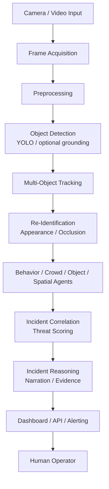

# EAGLES EYE

Eagles Eye is an AI-powered surveillance and security intelligence platform designed for real-time perception, anomaly detection, incident understanding, and operator decision support. It combines computer vision, tracking, re-identification, behavioral analysis, and multimodal evidence reasoning into a unified security operations pipeline.

This repository contains the application source, backend API, frontend dashboard, training utilities, sample metadata, and operational documentation required to run the system locally or extend it for custom deployments.

## Overview

The platform ingests camera and video streams, detects people and objects, tracks them across frames, correlates trajectories over time, and identifies suspicious activity patterns such as loitering, counter-flow, restricted-zone movement, object abandonment, and abnormal behavior. It then produces explainable findings, groups related evidence into incidents, and surfaces a dashboard with API access, forensic search, automation hooks, and human review controls.

Important release note: this repo intentionally does not include large public surveillance datasets, raw CCTV footage, or trained model weights. Those assets are downloaded or generated locally according to the project documentation.

## Key capabilities

| Capability | Status | Notes |
|---|---|---|
| Object detection | Implemented | YOLO-based detection backend with optional open-vocabulary grounding.
| Person and vehicle detection | Implemented | Core detection classes include people, vehicles, and common scene objects.
| Multi-object tracking | Implemented | ByteTrack-style tracking with temporal association and confidence handling.
| Dense crowd analysis | Implemented | Crowd density, flow, surge, and reversal metrics are computed from trajectories.
| Person re-identification | Implemented | Cross-camera matching and watchlist-style identity association are supported.
| Behavior analysis | Implemented | Loitering, counter-flow, restricted-zone movement, following patterns, and similar events are evaluated.
| Abandoned object detection | Implemented | Object separation and unattended object escalation are part of the reasoning workflow.
| Anomaly detection | Implemented | Training and runtime analysis support abnormal activity classification.
| Violence detection | Supported in project stack | Model/training assets are referenced and should be configured locally as required.
| Incident correlation | Implemented | Related findings are merged into incident timelines and risk-scored summaries.
| Forensic investigation | Implemented | Search and evidence retrieval are supported by the backend and RAG layers.
| Conversational incident analysis | Implemented | Template-driven or provider-backed reasoning is available for incident narratives.
| Digital twin / spatial intelligence | Implemented | Zone and coverage models plus AR-style spatial views are included.
| Automation hooks | Implemented | n8n and webhook-based automation integrations are available.

> Planned or optional features are clearly marked as such in the docs when they rely on external models, training data, or provider configuration.

## System architecture

The project follows a real-time perception pipeline from camera input to human decision support.



The actual runtime stack is organized as follows:

- Backend: FastAPI service, SQLAlchemy persistence, camera workers, agents, and event bus
- Frontend: Vite + React + TypeScript dashboard for cameras, incidents, alerts, and reports
- Vision modules: detection, tracking, crowd features, and re-ID logic
- Agent layer: behavior, object, watchlist, privacy, relationship, and threat assessment
- RAG / evidence layer: retrieval and conversational reasoning around incident records
- Deployment layer: Docker and VPS automation assets for deployment

## Repository layout

```text
Eagles-Eye-V1.0/
├── backend/                 FastAPI backend, AI agents, vision pipeline, persistence
├── frontend/                React + TypeScript dashboard and UI
├── docs/                    Architecture, installation, datasets, training documentation
├── training/                Training scripts and evaluation utilities
├── tools/                   Dataset generation, verification, and edge-worker utilities
├── datasets/                Metadata, manifests, and local dataset stubs only
├── storage/                 Local runtime storage for DB, media, models, reports, and evidence
├── config/                  Policy and runtime configuration files
├── deploy/                  Docker, n8n, and VPS deployment assets
├── portal/                  Public website / sign-in / dashboard entrypoints
├── ui_reference/            Design and reference export assets
├── weights/                 Optional local weights reference location; not committed by default
├── README.md                Project documentation
├── .gitignore               Release-safe ignore rules
├── .gitattributes           Git LFS hints for large binary assets when needed
├── .env.example             Example environment file for local setup
└── LICENSE                  Not included by default; verify legal requirements before publication
```

## Local setup

### 1) Backend

```bash
cd backend
python -m venv .venv
.venv\Scripts\python.exe -m pip install -r requirements.txt
copy .env.example .env
.venv\Scripts\python.exe -m uvicorn app.main:app --host 0.0.0.0 --port 8000 --reload
```

### 2) Frontend

```bash
cd frontend
npm install
npm run dev
```

Open the local UI at http://localhost:5173.

### 3) Optional GPU and model stack

Follow the instructions in [docs/INSTALL.md](docs/INSTALL.md) and [docs/DATASETS.md](docs/DATASETS.md) to install CUDA-enabled PyTorch, optional weights, and any public datasets you need for training or evaluation.

## Security and release handling

This repository is prepared as a public GitHub release and intentionally excludes secrets, local state, and large assets from Git. Before a push, the project should use:

- local `.env` files only
- placeholder credentials in example files
- external model hosting or Git LFS for large weights
- a local dataset directory only for metadata, annotations, and tiny reference samples

The repository does not bundle private keys, API tokens, or deployment secrets. Real credentials should stay on the developer machine and be supplied via environment variables during local execution.

## Dataset policy

This repository does not publish surveillance datasets or raw footage. The public release only references the required dataset categories and how to acquire them locally. The source data must be downloaded separately according to the official licensing terms for each dataset.

See [docs/DATASETS.md](docs/DATASETS.md) for:

- dataset names and purpose
- expected local directory structure
- public-source references
- training prerequisites
- where to place downloaded data locally
- which project modules consume each dataset

## Model policy

Large trained weights are not committed to the GitHub repository by default. The code expects them in local runtime directories such as `storage/models` or a configured path referenced by the environment settings.

This release uses a weight-management policy like:

- keep optional weights local
- prefer external hosting or Git LFS when redistribution is permitted
- document the origin, size, and licensing requirements for each required model
- never ship private or licensed evaluation checkpoints unless explicitly authorized

## Documentation

- [docs/ARCHITECTURE.md](docs/ARCHITECTURE.md) — system design and data flow
- [docs/INSTALL.md](docs/INSTALL.md) — local installation and GPU guidance
- [docs/DATASETS.md](docs/DATASETS.md) — dataset requirements and public data references
- [docs/TRAINING.md](docs/TRAINING.md) — training procedures and methodology
- [docs/TRAINING_RESULTS.md](docs/TRAINING_RESULTS.md) — evaluation summary and measured outputs
- [docs/EDGE_GPU.md](docs/EDGE_GPU.md) — GPU and edge-processing notes

## Release notes

This repository is intended for public technical release with a clean Git history and safe defaults. It is not a data bundle. It is a working application scaffold, backend, frontend, documents, and operator tooling designed to run locally once the user installs the required dependencies, models, and datasets.

The project remains open to extension, fine-tuning, and deployment but does not redistribute third-party surveillance datasets or proprietary pre-trained model artifacts without explicit rights.
>>>>>>> origin/main
